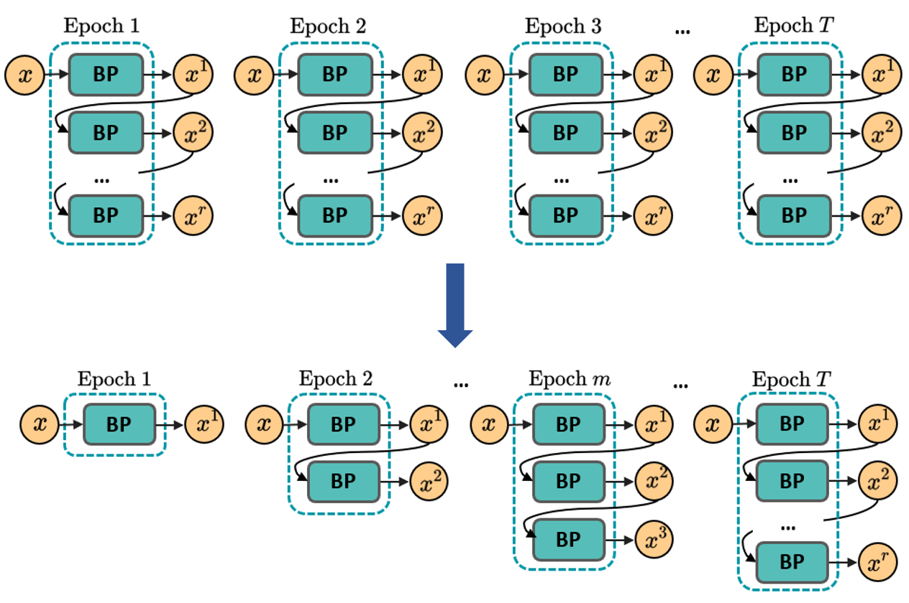
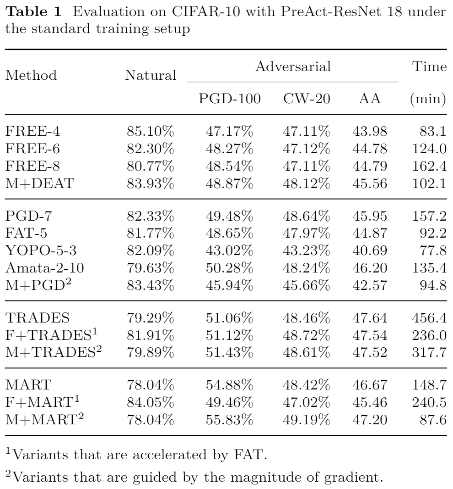
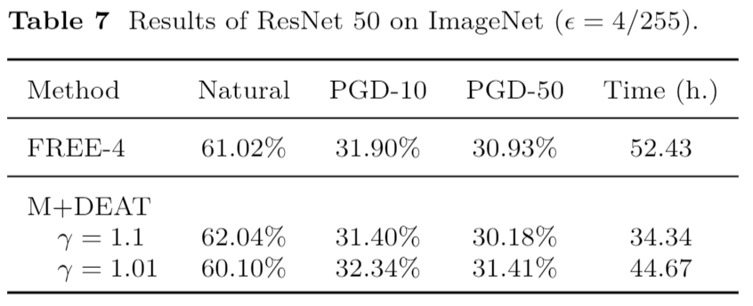

# DEAT
Codes for paper "Dynamic Efficient Adversarial Training Guided by Gradient Magnitude".

## Abstract
Adversarial training is arguably an effective but time-consuming way to train robust deep neural networks (DNNs) that can withstand strong adversarial attacks.
As a response to its inefficiency, we propose Dynamic Efficient Adversarial Training (DEAT), which gradually increases the adversarial iteration during training.
We first show the connection between the local Lipschitz constant of a given network and the magnitude of its partial derivative towards adversarial examples. 
Supported by this theoretical analysis, we further propose to utilize the gradient's magnitude for quantifying the effectiveness of adversarial training and thus enabling an automatic yet very effective way to adjust the training procedure.
This gradient magnitude based strategy is computationally efficient and easy to implement.
It is especially suited for DEAT and also can be applied with most existing adversarial training methods.
Experiments have been done on CIFAR-10, CIFAR-100, and ImageNet datasets with various training environments.
Compared with state-of-the-art methods, the proposed magnitude guided strategy boosts the training efficiency up to 40\% on CIFAR-10 models and 34\% on ImageNet models, demonstrating that the strategy is highly adaptive and provides a valuable solution for automatic adversarial training.
Our post-investigation suggests that maintaining the quality of the training adversarial examples at a certain level is essential to achieve efficient adversarial training, which may shed some light on future studies on robust deep learning.
For the purpose of reproducibility, we release the codes in this repository.

## Main idea

*Adversarial training is a dynamic process, and redundant adversarial iteration would hurt the trained models' robustness.*

This paper proposes a flexible adversarial training framework and designs a simple yet very efficient gradient magnitude guided strategy to adjust the adversarial iterations automatically. 
Such a procedure can be illustrated as:

    

## Empirical performances

### Benchmarking on CIFAR-10

Our method achieves state-of-the-art training efficiency and robustness performance comparing existing AT solutions, including FREE, FAT, YOPO, PGD, MART, and TRADES, and the trained networks show substantial robustness against various strong adversarial attacks. 
Moreover, the proposed acceleration strategy can directly work with existing AT methods and improve their training efficiency.

    

### Scalable to ImageNet

Our strategy is also capable of being deployed on large-scale dataset ImageNet.

    

*Code usages are provided in each corresponding folder.*

## Future direction
In this work, we have mainly explored $\ell_\infty$ norm based adversarial training, and our next step is to generalize the magnitude guided strategy into threat models under other metrics.
We believe that the ultimate goal of this direction would be an efficient adversarial training framework that can work under multiple threat models on various deep learning tasks.
Besides, the potential collaboration between our strategy and other efficient adversarial training methods is also an exciting and practical topic.
For example, YOPO only uses the first layer to generate training perturbation, and Amata adjusts adversarial step size along with the number of iterations.
These unique properties might be able integrated into our acceleration strategy and further boost the training efficiency.
